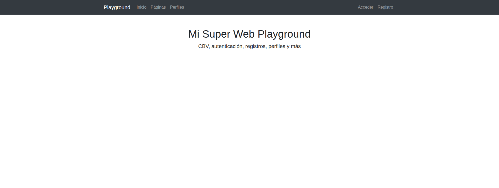
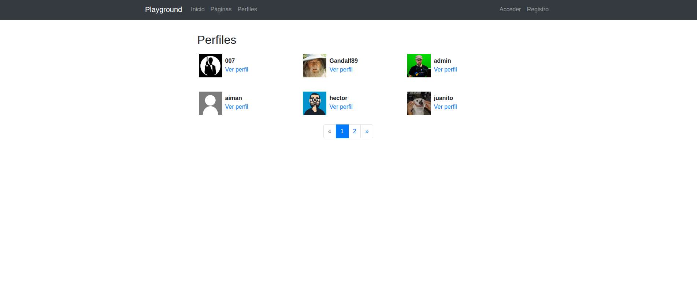
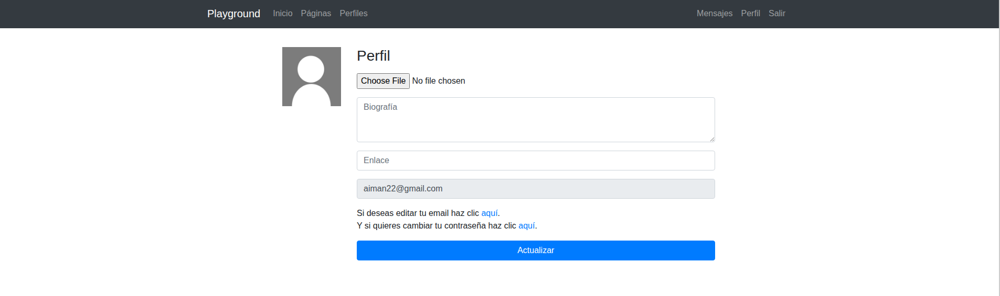
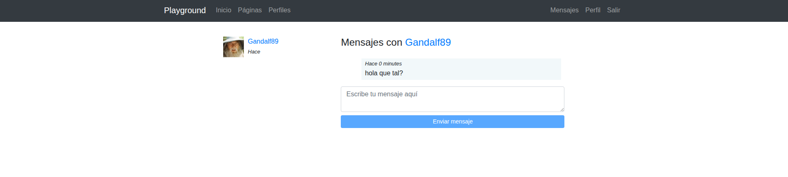
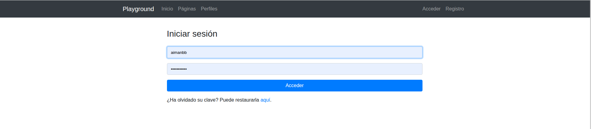
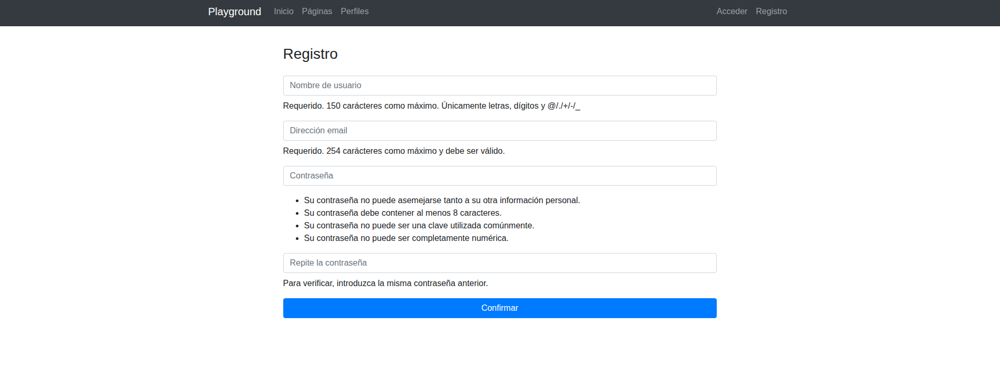

# Plataforma Integral de Gestión Empresarial (Django)  
Repositorio: [aimanjr77tech/enterprise-playground](https://github.com/aimanjr77tech/enterprise-playground)

> Plataforma interna de gestión de empleados, perfiles, mensajería y operaciones, desarrollada con Django, CBVs, sistema de autenticación, CRUDs completos y desplegada en Render.

---

##  Objetivo del proyecto  
El propósito de este proyecto es desarrollar una **solución web para entornos empresariales** que permita a una organización gestionar usuarios, perfiles, equipos, tareas, mensajería interna y operaciones básicas de negocio en un único sistema.  
El proyecto sirve como demostración de habilidades técnicas con Django orientadas a necesidades reales de empresa.

---

## Funcionalidades principales

- Autenticación de usuarios (login / logout).  
- Registro de usuarios con email obligatorio.  
- Sistema de perfiles extendidos: avatar, biografía, cargo, departamento.  
- CRUD completo para entidades clave: usuarios, empleados, perfiles, equipos, tareas.  
- Vista pública y panel interno de administración.  
- Manejo de permisos y mixins para controlar acceso.  
- Mensajería interna entre empleados.  
- ListView paginadas para datos de empresa.  
- Uso de señales de Django para automatizar procesos (por ejemplo, creación de perfil al registrar usuario).  
- Pruebas unitarias (TDD) para funciones críticas.  
- Interactividad asíncrona (JavaScript / AJAX) para mensajería sin recargar página.  
- Despliegue en producción mediante Render con servidor Gunicorn y gestión de estáticos.

---

##  Arquitectura y estructura del proyecto  
La aplicación se estructura en varias apps Django para separar responsabilidades, facilitando escalabilidad, mantenimiento y claridad de código.

enterprise-playground/
│
├── profiles/ # App para perfiles de empleados
├── messaging/ # App para sistema de mensajería interna
├── employees/ # App para manejo de empleados / usuarios
├── tasks/ # App para tareas y operaciones de empresa
├── core/ # Funcionalidad común, mixins, formularios base
├── enterprise_project/ # Proyecto Django: settings.py, urls.py, wsgi.py
│
├── manage.py
├── requirements.txt
├── README.md
└── etc.

yaml
Copiar código

Cada app contiene: modelos (`models.py`), vistas basadas en clases (`views.py`), formularios (`forms.py`), urls (`urls.py`), templates (`templates/app_name/`).

---

##  Tecnologías utilizadas  
| Área             | Tecnología                                               |
|------------------|----------------------------------------------------------|
| Backend          | Django, Python                                          |
| Frontend         | HTML5, CSS3, Bootstrap, JavaScript (AJAX)               |
| Base de datos    | SQLite (en desarrollo) / PostgreSQL (en producción)     |
| Despliegue       | Render, Gunicorn, WhiteNoise para archivos estáticos    |
| Gestión de versiones | Git + GitHub                                         |

---

##  Instalación y ejecución en local  
1. Clona el repositorio:
   ```bash
   git clone https://github.com/aimanjr77tech/enterprise-playground.git
   cd enterprise-playground
Crea y activa un entorno virtual:

bash
Copiar código
python3 -m venv venv
source venv/bin/activate  # Linux/macOS
# venv\Scripts\activate    # Windows
Instala las dependencias:

bash
Copiar código
pip install -r requirements.txt
Aplica migraciones:

bash
Copiar código
python manage.py makemigrations
python manage.py migrate
Crea un superusuario:

bash
Copiar código
python manage.py createsuperuser
Ejecuta el servidor de desarrollo:

bash
Copiar código
python manage.py runserver
Visita http://127.0.0.1:8000/ para ver el frontend y http://127.0.0.1:8000/admin/ para el panel administrativo.

 Despliegue en producción
Variables de entorno recomendadas:

ini
Copiar código
DEBUG=False
SECRET_KEY=tu_clave_secreta
ALLOWED_HOSTS=.onrender.com
Comandos de Build y Start en Render:

Build: pip install -r requirements.txt && python manage.py collectstatic --noinput && python manage.py migrate

Start: gunicorn enterprise_project.wsgi:application

 Capturas del Proyecto
(Sube tus imágenes en /screenshots/, luego actualiza rutas como screenshots/admin-dashboard.png)

Panel de Administración (Django Admin)


Interfaz Pública del Sitio Web


## Capturas del Proyecto

A continuación se muestran capturas del panel de administración y de la interfaz pública de la plataforma.  
Estas imágenes permiten visualizar la experiencia real de uso tanto para empleados como para administradores.

---

# Panel de Administración (Django Admin)

### ▶ Dashboard principal del administrador


### ▶ Gestión de empleados / usuarios


### ▶ Gestión de perfiles de empleados


### ▶ Gestión de tareas internas


### ▶ Sistema de mensajería interna desde el admin


---

# Interfaz Pública del Sitio Web

### ▶ Página de inicio


### ▶ Listado de empleados


### ▶ Perfil público de un empleado


### ▶ Mensajería interna (vista de usuario)


### ▶ Página de login / autenticación


### ▶ Página de registro 


---


👤 Autor
Nombre: Aiman Benslaiman

Github: aimanjr77tech

Email: aimanecom77@gmail.com

